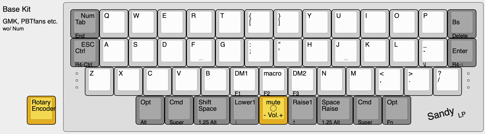

# SandyLP（サンディ エルピー）

  

`SandyLP` is a 40% keyboard with symmetrical row staggered layout and key height optimization.

Layered PCB will make height differences for each key.
This covers the lack of optimization to physical key layout in two dimensions that only adjust x-y plane.

---

`SandyLP`は、スイッチの配置を立体的にして高さ方向への最適化を加えた、左右対称ロースタッガード配列の40%キーボードです。  

平面上のキーレイアウトだけでは最適化しきれない部分を、キーの位置に応じてスイッチを配置する高さを変えることで補っています。

前機種の[Sandy](https://github.com/jpskenn/Sandy)を元に、ロープロファイルスイッチへの対応と、レイアウトの調整をおこなっています。

名前の由来は、立体的、つまり3Dという意味を込めたSandyの`ロープロファイル版 = Low Profile version`ということで`LP`をつけました。

## 特徴

### 左右対称のキーレイアウト  

[Jones](https://github.com/jpskenn/Jones)と同様の、2行目と3行目にずれのない、左右対称なシンメトリカル ロースタッガードのレイアウトです。  

一般的なロースタッガードなレイアウトとの共通性を残しつつ、左右対称で打鍵しやすくなるよう、[SemiErgo Layout](https://github.com/mtei/SemiErgo_Layout)に準ずるキーマッピングで使用することを念頭に設計しています。  
Z行の左右端にシフトキーを用意していないので、スペースキーを「Space and Shift」として使うと便利です。

各種キーキャップセットのうち「Base Kit」と呼ばれる基本的なキットですべてを埋めることができます。また、104キーの英語キーキャップセットでも十分実用が可能です。

詳しくは、[Keyboard Layout Editor: SandyLP](https://www.keyboard-layout-editor.com/#/gists/29f5da09ffa69ab85efa4c68b556282b)を参照してください。

### キースイッチを立体的に配置  

前機種の[Sandy](https://github.com/jpskenn/Sandy)と同じく、キースイッチを3段階の高さで立体的に配置しています。  
平面上ではキーを配置できる範囲が限られるため、一部のキーはどうしても指が届きにくくなってしまいます。例えば、[Jones](https://github.com/jpskenn/Jones)では左右対称のレイアウトを採用することで右手小指の`P`や`Back Space`、`Enter`などは打鍵しやすくなりましたが、右手人差し指の`Y`は少し遠く感じられました。  
このような箇所について、キーの配置を高くすることで打鍵しやすさを向上させています。  

キーの高さはLow（基準高＝0mm）, Middle（3.6mm）, High（8.7mm）の3段階で、以下のように配置されます。  

### キーボード自体が低い（薄い）  

ロープロファイルの`Choc V2`スイッチを採用することでキーボード自体が低くなりました。  
前機種のSandyからは7.2mm（※1）低くなり、パームレストを使わずとも、手首をあまり反らさないポジションで打鍵できます。

<small>※1 ボトムプレートから1段目のスイッチ軸の天面までの高さを比較。なお、Sandyは理論上あと0.8mm低くすることが可能です。</small>

### RP2040を採用した構成により、多機能なファームウェアを使用可能

RP2040を採用した構成により、キーボード向けのファームウェアを格納するには十分すぎるほどのフラッシュ容量を得ることができました。  
エンコーダーやオーディオ、その他各種機能の同時有効化や、多数のレイヤーを使用するなど、多機能なファームウェアを使用可能です。

### Remap、Vialによるキー割り当ての変更  

初期書き込み済みのファームウェアは[Remap](https://remap-keys.app/)に対応しており、プログラミング等の知識がなくても、キーマッピングやロータリーエンコーダへの割り当てを、ブラウザ等を使って簡単に変更できます。  

また、Vial対応のファームウェアに書き換えて使用することもできます。

### オプション機能  

- ロータリーエンコーダ
- インジケータLED
- オーディオ

## ビルドガイド

- [SandyLP（DN0010）](/docs/BuildGuide_DN0010.md)（最新版）

## SNSタグ

[#SandyLP_kbd](https://twitter.com/search?q=%23SandyLP_kbd)

## ギャラリー

  
w/ NuPhy nSA BOW

## 参考事例

- [TreK Lagoon](https://zenn.dev/digitarhythm/articles/a559b4b19fc959) by おおやけハジメ さん
- [Sparrow62](https://github.com/74th/sparrow62-buildguide/blob/master/sparrow62_v2.md) by 74th さん

## 開発経緯

以前開発した[Sandy](https://github.com/jpskenn/Sandy)を1年半ほど使い続け、日常使いの長期ロードテストとして十分な情報を得ることができました。  
その情報を元にSandyのアップデート版（Sandy DN0040）の開発をおこない、あとは基板製造の発注をするだけの段階となっていましたが、Sandyの課題のひとつとして挙げていた手首の負荷軽減、つまりキーボードを低くする変更を取り込まなかったことが様々な思いの中でほんのりと燻り続けていました。

ちょうどその頃、Choc V2スイッチのラインナップにたいへん素性の良い静音タイプが追加されました。そして、自分が普段好んで使っているMX用のキーキャップをそのスイッチと組み合わせて使えそうだという情報が得られたことから、ロープロファイルのスイッチを使用したSandyの派生版開発に踏み切りました。  

使用するスイッチの変更で、派生版の開発においてそこそこの量の設計変更が見込まれることから、ついでにキーレイアウトも変更することにしました。  
これまでに開発した`Jones`や`Sandy`では、頒布・販売することを念頭に想定するユーザーの最大公約数的なところへ歩み寄ったレイアウトにしていましたが、今回は自分の使用スタイルを最優先し、自分にとって不要な数字行や左右端のシフトキーなどを取り除いて、少し尖ったレイアウトに変更しました。

こうして、SandyLPが誕生することとなりました。
