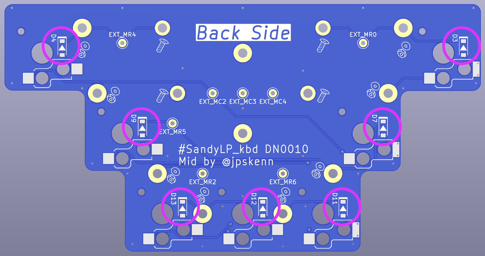
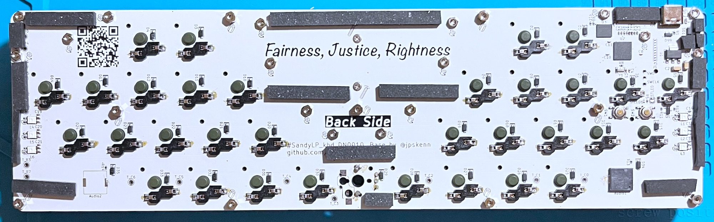
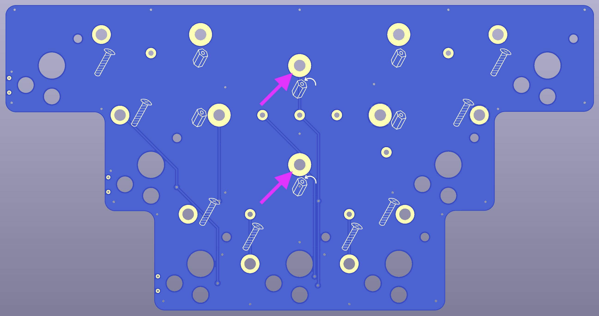
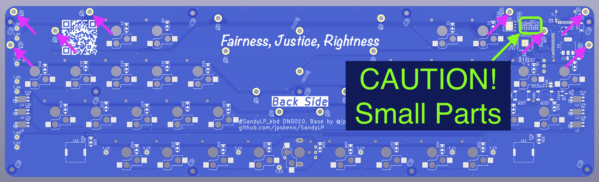
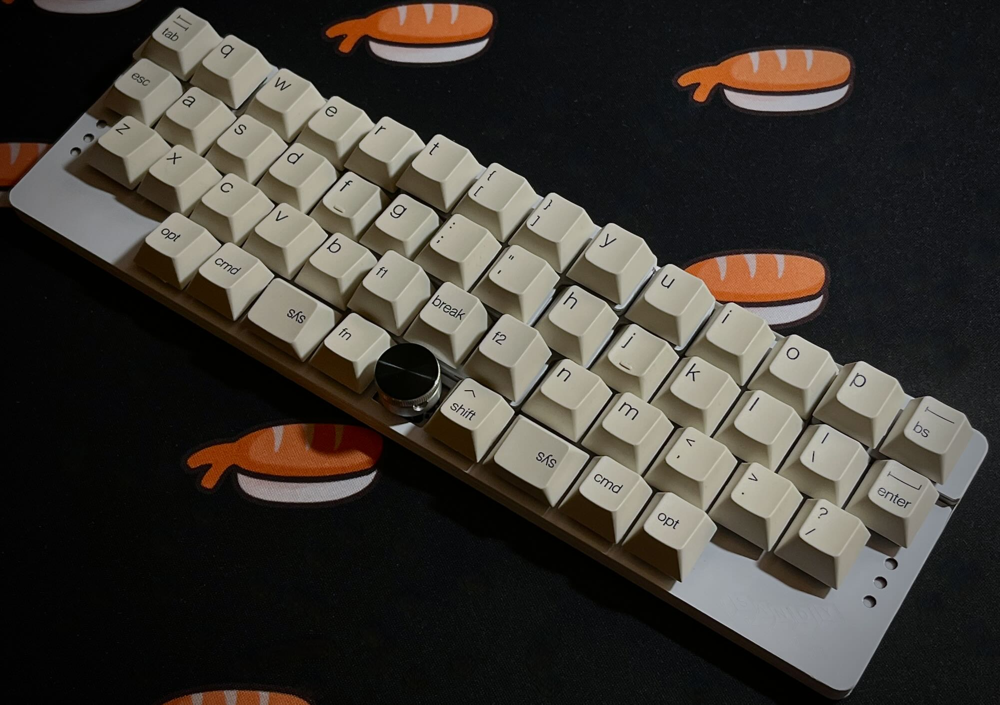

# SandyLP（DN0010）ビルドガイド

このドキュメントは、SandyLP（DN0010）を組み立てるためのビルドガイドです。

開発番号の`DN0010`は、各基板のうら側に記載されています。  
（Mid左右用スイッチプレートには記載がありません。）


SandyLPのコンセプトや特徴、ビルド例などについては、こちらの[README](/README.md)をご覧ください。

ビルドガイド全体に目を通して作業手順を把握しておくとミスの防止につながりますので、ぜひ、一度お読みになってから組み立て作業を始めてください。

## 目次

<!-- @import "[TOC]" {cmd="toc" depthFrom=1 depthTo=3 orderedList=false} -->

<!-- code_chunk_output -->

- [SandyLP（DN0010）ビルドガイド](#sandylpdn0010ビルドガイド)
  - [目次](#目次)
  - [注意事項](#注意事項)
  - [部品リスト](#部品リスト)
    - [キット内容](#キット内容)
    - [別途用意が必要な部品](#別途用意が必要な部品)
    - [オプション部品](#オプション部品)
  - [組み立てに使用する工具](#組み立てに使用する工具)
  - [組み立て手順](#組み立て手順)
    - [組み立て前の確認](#組み立て前の確認)
    - [【こだわり作業】基板とスイッチプレート側面をマジックで塗る](#こだわり作業基板とスイッチプレート側面をマジックで塗る)
    - [部品のはんだ付け](#部品のはんだ付け)
    - [基板へのネジ止めとゴムシート貼り](#基板へのネジ止めとゴムシート貼り)
    - [スイッチプレートへのゴムシート貼り](#スイッチプレートへのゴムシート貼り)
    - [基板とスイッチプレートをひとつに組み合わせて、スイッチを取り付ける](#基板とスイッチプレートをひとつに組み合わせて-スイッチを取り付ける)
    - [動作確認する](#動作確認する)
    - [ボトムプレートを取り付ける](#ボトムプレートを取り付ける)
    - [キーキャップを取り付ける](#キーキャップを取り付ける)
  - [ユーザーズマニュアル・カスタマイズガイド](#ユーザーズマニュアルカスタマイズガイド)
    - [初期ファームウェアの機能と設定値](#初期ファームウェアの機能と設定値)
    - [SandyLP関連ファイル](#sandylp関連ファイル)
    - [ファームウェアを書き換える](#ファームウェアを書き換える)
    - [EEPROMを消去して初期状態に戻す](#eepromを消去して初期状態に戻す)
    - [電源LEDを点灯しないようにする](#電源ledを点灯しないようにする)
    - [キーキャップの選び方](#キーキャップの選び方)
  - [サービスマニュアル](#サービスマニュアル)
    - [パーツリスト](#パーツリスト)
    - [基板セットアップ](#基板セットアップ)

<!-- /code_chunk_output -->

## 注意事項

開発ナンバー`DN0010`と`DN0011`はSandyLPの試作版です。

組み立てやすくなる工夫や細部の調整が施されていないため、自作キーボードや電子工作についてある程度わかっている方や、多少のことは自分でなんとかできる方以外は、手を出さないようにしてください。

## 部品リスト

このキットを組み立てて完成させるためには、[キット内容](#キット内容)に加え、[別途用意が必要な部品](#別途用意が必要な部品)が必要です。  

[オプション部品](#オプション部品)は用意しなくてもかまいません。使いたい機能に応じて用意してください。  

### キット内容

このキットに同梱されている部品等の内容です。  

| 部品名 | 個数 | 備考 |
| :-- | :--: | :-- |
| ご案内リーフレット | 1 | |
| 基板Base | 1 | この基板のみ、多数の部品を取り付け済み。 |
| 基板Mid中央 | 1 | |
| 基板Mid左右 | 2 | 同一形状の2枚のうち、ひとつをおもて側、もうひとつをうら側にして使用。 |
| 基板Top | 1 ||
| Base用スイッチプレート | 1 | 両面使えるリバーシブル仕様。好みのデザインの面をおもて側にして使用。 |
| Mid中央用スイッチプレート | 1 ||
| Mid左右用スイッチプレート | 2 | 同一形状の2枚のうち、ひとつをおもて側、もうひとつをうら側にして使用。 |
| Top用スイッチプレート | 1 | |
| ボトムプレート | 1 ||
| 短いスペーサー<br>両メネジ M2 3mm | 11 | [ヒロスギ ASB-2003E](https://hirosugi.co.jp/products/B/ASB-E.html#bx3) |
| 長いスペーサー<br>両メネジ M2 3.5mm | 6 |  [ヒロスギ ASB-2003.5E](https://hirosugi.co.jp/products/B/ASB-E.html#bx3) |
| ナット<br>M2 2種 高さ1.6mm | 35 | 予備1個含む。[ウィルコ FNT-02N-2](https://wilco.jp/products/F/FNT-N-2.html) |
| ワッシャー<br>M2 内径2.3mm 外径4.3mm 厚さ0.4mm| 19 | 予備1個含む。[ウィルコ FW-0204-04N](https://wilco.jp/products/F/FW-N.html#page3) |
| 短いネジ（2mm）<br>M2 2mm | 11 | [十字穴付なべ小ねじ](https://jp.misumi-ec.com/vona2/detail/110302280810/?ProductCode=BKJ2-2) |
| 短いネジ（3mm）<br>M2 3mm | 22 | 予備1個含む。[ウィルコ F-0230N-02](https://wilco.jp/products/F/F-N-02.html#page3) |
| 長いねじネジ<br>M2 6mm | 19 | 予備1個含む。[ウィルコ F-0260N-02](https://wilco.jp/products/F/F-N-02.html#page3) |
| ゴム足（大） | 2 | [光 HIKARI KKU-190](https://www.yodobashi.com/product/100000001001980663/) |
| ゴム足（小） | 5 | [CS-102](https://www.3mcompany.jp/3M/ja_JP/p/d/v000453068/) |
| ダイオード<br>1N4148W SOD123 | 20 | 予備3個含む。<br>[高速スイッチング・ダイオード 1N4148W](https://akizukidenshi.com/catalog/g/g107084/) |
| LED<br>SK6812MINI-E | 6 | [マイコン内蔵ＲＧＢＬＥＤ　ＳＫ６８１２ＭＩＮＩ－Ｅ](https://akizukidenshi.com/catalog/g/gI-15478/) |
| Chocスイッチ用ソケット | 50 | 最下行中央にロータリーエンコーダを取り付けない場合は49個。<br>[Kailh Switch Socket（Kailh Choc ロープロファイル用）](https://shop.yushakobo.jp/products/a01ps?variant=37665172553889) |
| 太くて薄いゴムシート<br>T=1mm 10mm * 500mm | 1+1/3 | [低弾性ゴムシート－ハネナイトＲ－](https://jp.misumi-ec.com/vona2/detail/110300277050/?ProductCode=UNLEA1-10) |
| 小さな薄いゴムシート<br>T=1.5mm 50mm * 10mm | 1 | [イノアック L32-1.550-MT マイクロセルウレタンロールPORON 黒 1.5×50mm×1M巻](https://www.yodobashi.com/product/100000001004002516/) |
| 細くて薄いゴムシート<br>T=2mm 5mm * 500mm | 1 | [低弾性ゴムシート－ハネナイトＲ－](https://jp.misumi-ec.com/vona2/detail/110300277050/?ProductCode=UNSEA2-5)
| 細くて分厚いゴムシート<br>T=3mm 5mm * 500mm | 1 | [低弾性ゴムシート－ハネナイトＲ－](https://jp.misumi-ec.com/vona2/detail/110300277050/?ProductCode=UNSEA3-5) |

※出荷時期によって、機能的に同等なものへ変更することがあります。

基板  
左上から時計回りに、基板Top、基板Mid中央、基板Mid左右（2枚）、基板Base。  
  

プレート類  
左上から時計回りに、Top用スイッチプレート、Mid中央用スイッチプレート、Mid左右用スイッチプレート（2枚）、Base用スイッチプレート、ボトムプレート。  
  

その他部品  
  
〓ネジとかは乗せなくても良いけど、ゴムシートは見分けがつきにくいので、写真を載せる。

### 別途用意が必要な部品

完成させるには、キット内容とは別に、以下の部品を用意する必要があります。

| 部品名 | 個数 | 備考 |
| :-- | :--: | :-- |
| Choc V2スイッチ | 50 | ロータリーエンコーダを取り付ける場合は49個。<br>Choc V1スイッチは、固定ピンがないもの、または取り外したものであれば取り付け可能。 |
| キーキャップ<br>Choc V2スイッチ用 | 必要数 | MXスイッチ用のキーキャップは、スイッチプレートに干渉することがあります。<br>GMK等のいわゆるBase Kitを使用すると、良い具合に仕上げることができます。<br>詳しくは[キーキャップの選び方](#キーキャップの選び方)をご覧ください。 |
| USBケーブル （Type-C） | 1 | Base基板に取り付けられているコネクタはType-Cです。 |

### オプション部品

オプション部品は無くてもかまいません。  
使いたい機能に応じて用意します。

| 部品名 | 個数 | 備考 |
| :-- | :--: | :-- |
| ロータリーエンコーダ<br>ALPS EC11, EC12同等品 | 1 | ロータリーエンコーダを使用する場合。<br>プッシュスイッチ付きにも対応。 |
| ロータリーエンコーダ用ノブ（つまみ） | 1 | ロータリーエンコーダを使用する場合。 |
| スピーカー<br>Murata PKMCS0909E4000-R1 | 1 | [PKMCS0909E4000-R1](https://www.digikey.jp/ja/products/detail/murata-electronics/PKMCS0909E4000-R1/4878400) |

## 組み立てに使用する工具

こちらの[工具セット](https://shop.yushakobo.jp/products/a9900to)などを参考に工具を用意します。

- 必要な工具

  - M2ネジに対応する、先の細いプラスドライバー（+0）

  - はんだ付け関連用品

    はんだ、はんだごて（温度調整機能つきを推奨）、こて台、ピンセットなど。  
    小さな部品のはんだ付けや、ちょっとした修正、取り外しなどの作業がしやすくなるので、フラックスやハンダ吸い取り線もあると良いでしょう。

  - はさみ または カッター
    ゴムシートの切断に使用。

- あると便利な工具

  - マジックペン

    基板の側面を塗ると、完成時の質感が上がります。  
    暗めの色を塗る場合は[プロッキー](https://www.mpuni.co.jp/products/felt_tip_pens/water_based/sign_pen/prockey.html)を、明るめの色を塗る場合は不透明顔料インクの[ポスカ](https://www.mpuni.co.jp/products/felt_tip_pens/water_based/posca/standard.html)を使うなど、お好みで。

  - M2ナット対応のレンチ，ナットドライバー

    ナットを締める箇所が多いので、あると作業が格段に楽になります。  
    [タミヤ SP.38 工具セット](https://www.tamiya.com/japan/products/50038/index.html)の十字レンチが安くておすすめ。

  - テスター  
    はんだ付けの確認作業や、何か不具合があった場合の原因調査で活躍します。

## 組み立て手順

手順に沿って、順番に組み立てます。

- 【こだわり作業】の手順は、完成時の質感を重視した内容であり、不要であれば作業をとばしてもかまいせん。

- 【該当者のみ】の手順は、条件に該当する場合のみ作業します。

- おもて側とうら側を間違えないよう、基板うら側の「Back Side」の表記を確認しながら作業を進めます。

  

### 組み立て前の確認

出荷前に基本的な動作確認を実施済みですが、輸送時の破損なども考えられるため、組み立てを始める前に動作確認をおこないます。  
確認結果に問題がある場合は、リーフレットに記載の連絡先へ相談してください。

#### 基板BaseがPCやMacで認識されるかを確認する

1. `基板Base`を、うら側を上にして安定した場所へ置く。

1. `基板Base`のUSBコネクタへケーブルを差し込み、PCやMacに接続する。

1. 電源LED`STLED1`が緑に点灯することを確認する。

1. PCやMacで、キーボードとして認識されていることを確認する。  
    確認例：
    - Windows 11  
    設定 → Bluetoothとデバイス → デバイス → 入力  
    「sandy_lp」が表示されていること。

    - Mac  
    システムレポート → USB  
    「sandy_lp」が表示されていること。

#### 基板Baseの反応を確認する

1. [Remap（https://remap-keys.app/）](https://remap-keys.app/)を、対応するブラウザ（ChromeやEdgeなど）で開く。

1. `CUSTOMIZE YOUR KEYBOARD`ボタンを押す。

1. `+ KEYBOARD`を押す。

1. ポップアップ画面で`sandy_lp`を選択して、`接続`を押す。  
    次の画面で`Please import your sandy_lp definition file(.json).`というメッセージが表示された場合
    1. 別途、[SandyLPのVIA用jsonファイル（sandylp_DN0010_via.json）](https://github.com/jpskenn/SandyLP/blob/main/VIA/sandylp_DN0010_via.json)をダウンロードしておく。
    1. Remapの画面で`IMPORT(.JSON)`を押し、ダウンロードしておいた`sandylp_DN0010_via.json`を選択して開く。

1. 画面にキーボードのレイアウトが表示されるまでしばらく待つ。

    30秒待っても表示されないときは、ブラウザをリロードしてやり直します。

1. キーボードのレイアウトの右側の一番下にある`…`をクリックして、表示されたメニューから`Test Matrix Mode`を選択する。

1. キースイッチの反応を確認する。

    `基板Base`うら側のスイッチソケット取り付け用パッド（銀色の四角い端子部分）をピンセットなどでショートさせ、ブラウザ画面上の対応するキーの色が変わることを確認します。

    

    すべてのパッドで実施した後、以下のように色が変われば正常です。  
    

### 【こだわり作業】基板とスイッチプレート側面をマジックで塗る

完成時の質感を高めるため、すべての基板とスイッチプレート、ボトムプレートの側面をマジックで塗ります。

💡ヒント：組み立て後は、スイッチを取り外したりネジを外して分解したりしないと塗れなくなる箇所があります。後からやるのは大変なので、この段階でやってしまった方が楽です。

### 部品のはんだ付け

#### 基板Topへのはんだ付け

1. `基板Top`を、うら側の「Back Side」と書かれた面が見えるように置く。

1. `ダイオード`を取り付ける。（6個）

    基板のダイオード用パッド2個のうち、片方のパッドに予備はんだ（はんだを少しだけつけておく）します。  
    基板に描かれた枠のうち、短辺が閉じている方向（▲マークが示す先の少し太い線がある方向）にダイオードの印を合わせ、予備はんだしたところへ、ダイオードの端子をはんだ付けします。  
    最後に、もう一方の端子をはんだ付けします。

    
    

1. `Chocスイッチ用ソケット`を取り付ける。（6個）

    基板に描かれた枠に合わせてソケットを置きます。  

    💡ヒント：Chocスイッチ用ソケットは、取り付ける方向が決まっています。参考：[Kailh Choc ソケットの方向について](https://scrapbox.io/self-made-kbds-ja/Kailh_Choc_ソケットの方向について)

    

    はんだごての温度を270度程度にセットして、はんだ付けします。  

    ソケットが基板から浮かないように注意し、基板にぴったりと接するように取り付けます。

    

#### 基板Mid中央へのはんだ付け

1. `基板Mid中央`を、うら側の「Back Side」と書かれた面が見えるように置く。

1. `ダイオード`を取り付ける。（7個）

    

1. `Chocスイッチ用ソケット`を取り付ける。（7個）

    

#### 基板Mid左右へのはんだ付け

1. `基板Mid左右`2枚のうち、ひとつを「L Back」と書かれた面が見えるように置き、もうひとつを「R Back」と書かれた面が見えるように置く。

1. `ダイオード`を取り付ける。（左右それぞれ2個、計4個）

    

    

1. `Chocスイッチ用ソケット`を取り付ける。（左右それぞれ2個、計4個）

    

    

#### 基板Baseへのはんだ付け

1. `基板Base`を、うら側の「Back Side」と書かれた面が見えるように置く。

1. うら側から、`Chocスイッチ用ソケット`を取り付ける。（33個。ロータリーエンコーダを取り付ける場合は32個）

    ロータリーエンコーダを取り付ける場合は、最下行中央のソケットは取り付けません。

    

1. 【該当者のみ】うら側から`LED`を取り付ける。（左右に3個ずつ。計6個）

    条件：インジケータLEDを使用する場合

    取り付け場所：うら側 `L1` から `L6`

    

    LED取り付け用パッド（1個のLEDに4個のパッド）のひとつに、予備はんだしておきます。  
    基板に描かれた印にLEDの端子の切り欠き部分を合わせ、LED発光部が基板おもて側になるように置きます。  

    

    予備はんだした箇所を、220度程度の温度ではんだ付けします。  
    （はんだが溶けにくい場合は、270度程度まで温度を上げ、短時間で作業します。）

    残りのパッドをはんだ付けします。

    6個すべてのLEDを取り付けたら、USBケーブルでPCやMacに接続し、LEDがすべて白色に点灯することを確認します。  
    （ケーブル接続時に一瞬だけ赤色に点灯する場合がありますが、正常な動作です。）

1. 【該当者のみ】うら側から`スピーカー`を取り付ける。

    条件：スピーカーを使用する場合

    取り付け場所：うら側 `LS1`（`LS2`は実験用のため、取り付けしません。）

    

    スピーカーの金属端子部分を基板上のパッドに合わせてスピーカーを置き、スピーカー側面からはんだ付けします。

    💡ヒント：スピーカーはどの方法で取り付けてもかまいませんが、スピーカー上面の小さな穴から音が出てくるので、この穴がキーボード手前側にくるように取り付けると、音が聞こえやすくなるような気がします。

1. 【該当者のみ】おもて側から`ロータリーエンコーダ`を取り付ける。（1個）

    条件：ロータリーエンコーダを使用する場合

    取り付け場所：おもて側 最下行中央部

    **☠️危険：ロータリーエンコーダは「おもて側」からはめ込みます。**

    うら側からはんだ付けします。  

    

### 基板へのネジ止めとゴムシート貼り

**☠️危険：ネジやナットを締めこむ際は、少し抵抗を感じて「クククッ」と止まったあたりで締めこむのをやめます。**
**「ギュゥギュゥ」と締めこみすぎると、そのうち基板が物理的に破壊されます。**

💡ヒント：ネジ穴の隣には、その場所に取り付ける「ネジ」・「スペーサー」・「ナットとワッシャー」などのアイコンが描かれています。  
  

#### 基板Topへのゴムシート貼り

1. `基板Top`うら側から、`小さな`を貼る。（6個）

    各種パーツやネジ穴に重ならない位置へ、フォームを貼ります。  
    少し曲げたり、一部をカットしてから貼ってもかまいません。

    貼り付け例  
    

#### 基板Mid中央へのネジ止めとゴムシート貼り

1. `基板Mid中央`のうら側から、`長いスペーサー`を`短いネジ（3mm）`でとめる。（4箇所）

    ```text
    長いスペーサー（3.5mm）
    ↑
    －－ 基板Mid中央 －－
    ↑
    短いネジ（3mm）
    ```

    

1. おもて側から、`ワッシャー`を挟んだ`ナット`を`長いネジ`でとめる。（8箇所）

    ```text
    長いネジ（6mm）
    ↓  
    －－ 基板Mid中央 －－  
    ↓  
    ワッシャー  
    ↓  
    ナット
    ```

    

1. うら側の空いたスペースに`細くて薄いゴムシート`を貼る。

    **☠️異なる厚さのゴムシートを貼ると、正しく組み立てられません。**

    防振と打鍵感向上のため、各種パーツやネジ穴に重ならない位置へ、ゴムシートをはさみなどで切断して貼ります。  
    貼り付け位置は、以下のとおりです。

    ゴムシート貼り付け位置  
    

#### 基板Mid左右へのネジ止めとゴムシート貼り

1. `基板Mid左右`のおもて側から、`ワッシャー`を挟んだ`ナット`を`長いネジ`でとめる。（左右それぞれ4箇所、計8箇所）

    ```text
    長いネジ（6mm）
    ↓  
    －－ 基板Mid左右 －－  
    ↓  
    ワッシャー  
    ↓  
    ナット
    ```

    

    

1. うら側の空いたスペースに`細くて薄いゴムシート`を貼る。

    **☠️危険：異なる厚さのゴムシートを貼ると、正しく組み立てられません。**

    ゴムシート貼り付け位置  
    

#### 基板Baseへのネジ止めとゴムシート貼り

1. `基板Base`のおもて側から、`短いスペーサー`を`短いネジ（2mm）`でとめる。11箇所）

    **☠️危険：この手順のみ`短いネジ（2mm）`を使用します。**

    ```text
    短いネジ（2mm）
    ↓  
    －－ 基板Mid左右 －－  
    ↓  
    短いスペーサー（3mm）
    ```

    

1. うら側から、`ワッシャー`を挟んだ`ナット`を`長いネジ`でとめる。（2箇所）

      ```text
      ナット
      ↑
      ワッシャー  
      ↑
      －－ 基板Mid －－  
      ↑
      長いネジ（6mm）  
      ```

    

1. うら側から、`細くて分厚いゴムシート`を貼る。

    **☠️危険：異なる厚さのゴムシートを貼ると、正しく組み立てられません。**

    ゴムシート貼り付け位置  
    

### スイッチプレートへのゴムシート貼り

**☠️危険：異なる厚さのゴムシートを貼ると、正しく組み立てられません。**

`すべてのスイッチプレート`の裏面に`太くて薄いゴムシート`を貼ります。  
スイッチプレートの細い箇所には、ゴムシートを半分、または1/3の幅に切断してから貼るようにします。  
貼り付け位置は、以下のとおりです。

ゴムシート貼り付け位置  
Base用スイッチプレート  


Mid中央用スイッチプレート  


Mid左右用スイッチプレート  


Top用スイッチプレート  


### 基板とスイッチプレートをひとつに組み合わせて、スイッチを取り付ける

**☠️危険：ネジやナットを締めこむ際は、少し抵抗を感じて「クククッ」と止まったあたりで締めこむのをやめます。**

1. `基板Base`と`基板Mid中央`を組み合わせる。

    それぞれのネジ穴にはまるように重ね合わせます。  

    `基板Base`のうら側から、`基板Mid中央`のネジを`ナット`で止めます。（8箇所）

    ```text
    －－ 基板Mid中央 －－  
    ↓  
    －－ 基板Base －－  
    ↑  
    ナット
    ```

    

    `基板Mid中央`のおもて側から、`長いスペーサー`を取り付けます。（2箇所）

    ```text
    長いスペーサー(3.5mm)
    ↓
    －－ 基板Mid中央 －－  
    ↑  
    －－ 基板Base －－  
    ```

    

1. `基板Base`と`基板Mid左右`を組み合わせる。

    ネジ穴にはまるように重ね合わせます。  

    `基板Base`のうら側から、`基板Mid左右`のネジを`ナット`で止めます。（ぞれぞれ4箇所、計8箇所）

    ```text
    －－ 基板Mid左右 －－
    ↓
    －－ 基板Base －－
    ↑
    ナット
    ```

    

1. `Mid中央用スイッチプレート`とスイッチを取り付ける。

    スイッチの端子が曲がっていないことを確認します。  
    スイッチプレートを基板の形に合わせて重ねます。  
    スイッチの端子と基板のソケットの方向を確認します。  
    スイッチプレートを挟みながら、スイッチをまっすぐに押し込んで取り付けます。  

    メモ：  
    スイッチによっては、スイッチプレートへのはめ込みがきついものがあります。  
    Kailh Lofree FLOW GHOSTはけっこうきつく、Kailh Deep Sea Silent MINIは適度な具合でした。

    ```text
    －－ スイッチ －－
    ↓
    －－ Mid中央用スイッチプレート －－
    ↓
    －－ Mid中央基板 －－
    ```

    スイッチがプレートにぴったりとはまっていることを確認します。  

    以下の写真はスイッチがプレートにはまっておらず、プレートが押し下げられた不正な状態です。  
    プレートの端を指で持ち上げたりして、スイッチをプレートにぴったりとはめ込みます。  
    

1. `基板Top`と`基板Mid中央`を組み合わせる。

    間に`Mid中央用スイッチプレート`をはさむようにして、ネジ穴にはまるように重ね合わせます。  

    `基板Top`のおもて側から、`基板Mid中央`のスペーサーを`短いネジ（3mm）`で止めます（6箇所）

    ```text
    短いネジ（3mm）
    ↓  
    －－ 基板Top －－
    ↑  
    －－ 基板Mid中央 －－
    ```

1. `基板Base`に、`Base用スイッチプレート`と`スイッチ`を取り付ける。

    💡ヒント：`Base用スイッチプレート`は、ロゴ入りのおもて面と、無地のうら面のどちら向きでも使えるリバーシブル仕様です。  
    キーキャップを取り付けるとプレートに書かれた文字はほとんど見えなくなりますが、小さ目のキーキャップを使う場合は少し目立ってしまうかもしれません。

    ```text
    スイッチ
    ↓
    －－ Base用スイッチプレート －－
    ↓
    －－ Base基板 －－
    ```

1. `基板Mid左右`に、`Mid左右用スイッチプレート`と`スイッチ`を取り付ける。

    ```text
    スイッチ
    ↓
    －－ Mid左右用スイッチプレート －－
    ↓
    －－ Mid基板 －－
    ```

1. `基板Top`に、`Top用スイッチプレート`と`スイッチ`を取り付ける。

    ```text
    スイッチ
    ↓
    －－ Top用スイッチプレート －－
    ↓
    －－ Top基板 －－
    ```

### 動作確認する

1. [Remap](https://remap-keys.app/)の`Test Matrix Mode`を使用して、すべてのキースイッチが正常に反応するか確認する。

    異常がある場合は、原因を調査して修正します。

### ボトムプレートを取り付ける

1. 組み合わせた基板を裏返し、USBコネクタの切り欠き部分の位置を合わせながら`ボトムプレート`を乗せる。

1. `ボトムプレート`うら側から、`短いネジ（3mm）`で止める。（11箇所）

    ```text
    －－ 組み合わせた基板 －－
    ↓  
    －－ ボトムプレート －－
    ↑
    短いネジ（3mm）
    ```

    

1. ボトムプレートのうら側から、ゴム足を貼る。

### キーキャップを取り付ける

1. `キーキャップ`を取り付ける。

1. 【該当者のみ】`ロータリーエンコーダ`の`ノブ`を取り付ける。

    条件：ロータリーエンコーダを使用する場合

以上で組み立て完了です。


## ユーザーズマニュアル・カスタマイズガイド

SandyLPの機能や関連情報、また、自分の好みにカスタマイズする方法について説明します。

### 初期ファームウェアの機能と設定値

出荷時に書き込まれている初期ファームウェアの機能と設定値を説明します。

- QMKバージョン

  0.26.3

- キーマップ書き換えツールのRemapに対応（VIA有効化）。

- レイヤー構成とレイヤーインジケータLEDの色

  レイヤー0から7まで、8個のレイヤーが使用できます。  
  LEDは左右とも同じパターンで点灯します。`－`は元のレイヤー色、`×`は消灯を意味します。

    | No. | レイヤー名 | 主なキー割り当て | LEDの色 上, 中, 下 |
    | :-: | :-- | :-- | :-: |
    | 0 | ベースレイヤー #1 | [SemiErgo](https://github.com/mtei/SemiErgo_Layout)風 英語配列, Mac向けモディファイア | 白, 白, 白 |
    | 1 | ベースレイヤー #2 | ↑ | 青, 青, 青 |
    | 2 | ベースレイヤー #3 | テンキー | 黄, 黄, 黄 |
    | 3 | Lower #1 | ファンクションキー<br>記号<br>音量コントロール | －, 緑, － |
    | 4 | Lower #2 | ↑ | －, 黄緑, － |
    | 5 | Raise #1 | 数字行<br>記号<br>カーソル移動 | －, 水, － |
    | 6 | Raise #2 | ↑ | －, 紫, － |
    | 7 | Adjust | ベースレイヤー切り替え<br>LED、Audio等の設定<br>スクロールロックなど | －, 赤, － |
    | 番外| CapsLock | n/a | －, －, 赤紫 |

- ロータリーエンコーダ

  プッシュボタン付き1個に対応。

- スピーカー

  スピーカー1個に対応。

- その他

  - レイヤー移動する

    レイヤーを移動するには、以下の操作をおこないます。

    - Lower #1：左手スペースの右側のキー
    - Raise #1：右手スペースキー
    - Adjust：上記2キーを同時押し

  - ベースレイヤーを記憶させる

    ベースレイヤーを切り替えるには、`Adjust`レイヤーの`Q`（ベースレイヤー #1）、`W`（ベースレイヤー #2）または`E`（ベースレイヤー #3）を押します。  
    この切り替えは、キーボードの電源が失われると元に戻ります。

    キーボードに切り替えたベースレイヤーを記憶させるには、  
    上記の操作を `Shift` と組み合わせておこないます。

    例えば、`Shift + AdjustレイヤーのW` を押すと `ベースレイヤー #2` へ切り替わると同時に、キーボードに記憶されます。
    キーボードが記憶しているので、キーボードの電源が失われても、次回接続した際に`ベースレイヤー #2`の状態で起動します。

  - キーボードの起動音（＝スピーカー機能）をON/OFFする

    `Adjust`レイヤーの`Z`を押すごとに、ON/OFFが切り替わります。  
    この操作により、スピーカー機能自体がON/OFFされるので、ピコピコ音や音楽鍵盤機能もOFFになります。

  - キー押下時のピコピコ音をON/OFFする

    `Adjust`レイヤーの`X`を押すごとに、ON/OFFが切り替わります。  
    なお、キーボードの起動音（＝スピーカー機能）がOFFになっているときは、ピコピコ音は鳴りません。

  - レイヤーインジケータの表示状態を切り替える

    レイヤーインジケータの表示状態は、以下の4通りの表示に切り替えることができます。

    - 左右両方に表示
    - 左のみ表示
    - 右のみ表示
    - インジケータ表示なし

    表示状態は`Adjust`レイヤーの`O（オー）`を押すごとに切り替わり、表示状態はEEPROMに保存されます。

    なお、インジケータ表示がない場所には、QMKの[RGB Lighting](https://docs.qmk.fm/features/rgblight)が表示されます。  
    LEDを完全に消灯するには、`Adjust`レイヤーの`L`を押して、RGB LightingをOFFにします。

  - レイヤーインジケータの明るさを調整する

    レイヤーインジケータの明るさは、RGB Lightingの明るさに連動しています。

    明るさを調整するには、  
    （RGB LightingがOFFのときは、`Adjust`レイヤーの`L`を押してONにしてから）
    `Adjust`レイヤーの`I`または`K`で明るさを調整します。

    調整が終われば、もういちど`Adjust`レイヤーの`L`を押してRGB LightingをOFFにしてもかまいません。

### SandyLP関連ファイル

このキーボードに関連するファイルです。  

- 〓ビルド済みファームウェア（QMK バージョン 0.26.3）： sandy_DN0010_qmk_0.26.3_via.hex

    [Sandy_DN0010_files2](https://gist.github.com/jpskenn/16a033668dabca065a8330595d4761a1)（Zipファイルをダウンロードして展開）

- 〓ビルド済みファームウェア（Vial [bb7961c](https://github.com/jpskenn/vial-qmk/commit/bb7961c3c27666c154393bca22aef31f8e60f5b9)）： sandy_DN0010_via.hex

    [Sandy_DN0010_files](https://gist.github.com/jpskenn/916b2abc9b1252dcd62130175d11db3e)（Zipファイルをダウンロードして展開）

- ファームウェアのソース

    私がQMKからフォークしたリポジトリ[https://github.com/jpskenn/qmk_firmware](https://github.com/jpskenn/qmk_firmware)の、[develop_SandyLP_QMK_0.26.3](https://github.com/jpskenn/qmk_firmware/tree/develop_SandyLP_QMK_0.26.3)ブランチ内、`keyboards/sandy_lp/DN0010`に配置しています。  

- 基板等の設計ファイルやドキュメント、Remapの定義ファイルなど

    [SandyLPリポジトリ](https://github.com/jpskenn/SandyLP)のリリース[DN0010](https://github.com/jpskenn/SandyLP/releases/tag/DN0010-001)にまとめてあります。

### ファームウェアを書き換える

**☠️危険：作業に失敗するとキーボードが機能しなくなることがあります。内容を理解した上で、自己責任でおこなってください。**

1. 以下の操作をおこない、SandyLPをマスストレージデバイスとしてPCやMacに認識させます。

    1. USBケーブルが接続されている場合は、ケーブルを抜く。
    1. キーボードうら側の`SW1`ボタン（文字が見えにくいので写真を参照）を押したまま、USBケーブルを差し込む。  
        ケーブルを差し込んだら、ボタンから手を離す。  
    
    1. PCやMacで、マスストレージの`RPI-RP2`として接続・認識されているか確認する。

1. 書き込みたいファームウェアのUF2ファイル（example.uf2）を、先ほどの`RPI-RP2`へコピー＆ペーストなどの操作で保存します。

以上で書き込み作業は完了です。  

UF2ファイルを保存すると、勝手に（自動的に）マスストレージの接続が解除され、キーボードとして起動します。  
Macでは「ディスクの不正な取り出し」に関するメッセージが表示されますが、特に問題ないので無視してかまいません。（Windowsは知りません）

### EEPROMを消去して初期状態に戻す

EEPROMに記録されているデータを消去し、初期状態に戻す方法について説明します。  

キーマップやLEDの表示モードなどのEEPROMに記録されているデータを消去し、初期状態に戻すことができます。  

1. USBケーブルを接続している場合は、ケーブルを抜きます。

1. キーボードの左上のキーを押したまま、USBケーブルを差し込みます。

1. ケーブルを差し込んで、1、2と数えてから、キーを押していた指を離します。
    キーボードが、PCやMacでマスストレージデバイスとして認識されます。

1. 5秒ほど待ってから、USBケーブルを抜きます。

1. USBケーブルを差し込みます。
    キーボードが起動します。

以上の操作でEEPROMが消去され、初期状態に戻ります。

### 電源LEDを点灯しないようにする

`基板Base`うら側の電源LEDは、ファームウェアの動作状況に関わらず、USBコネクタからの電源によって点灯しています。

電源LEDを点灯しないようにするには、次の手順をおこないます。  

1. `基板Base`うら側、`STLED`がはんだでジャンパされ、2つのパッドがつながった状態になっています。  
1. はんだごてを軽く当ててはんだを一部取り除き、つながっていない状態にします。

電源LEDを点灯させる場合は、`STLED`をはんだでジャンパして、つながった状態にします。

### キーキャップの選び方

このキーボードで使用するChoc V2スイッチには、十字形状の穴をもつ、いわゆるCherry MXに互換性のあるキーキャップ（以降、MX用キーキャップと言う）を取り付けることができます。  

しかし、ほとんどのMX用キーキャップはChoc V2などのロープロファイルなスイッチに合わせて設計されていないため、押下時にスイッチやスイッチプレートに当たり、干渉してしまうことがあります。  
また、Choc V2スイッチは販売時期やシリーズによってトップハウジングの形状が異なっているため、干渉を避けるにはキーキャップとスイッチの組み合わせが重要となります。

組み合わせについては、[Kailh x Lofree Shadowシリーズ、Kailh Choc V2(Deep Sea Silent MINI)で使えるキーキャップを調査した](https://74th.hateblo.jp/entry/chocv2-compatible-keycap)が参考になります。

また、私自身が試した組み合わせの結果を以下に記録しておきますので、参考にしてください。（干渉しないことを保証するものではありません）

| スイッチ | キーキャップ | 干渉の有無 | 使用感 |
| :-- | :-- | :-- | :-- |
| Kailh Lofree FLOW GHOST | ePBT, Cherry, Less But Better | プレート干渉はほぼなし。スイッチに当たっている感じがある。 | スイッチ自体の底打ち衝撃と干渉の音が若干ズレるような感じがあり、あまり気持ちよくない。 |
| Kailh Lofree FLOW GHOST | ENJOYPBT DOUBLESHOT ABS, Cherry, Dolch Yellow | プレート干渉あり。スイッチ干渉不明（プレートに先に当たってしまっている？） |  |
| Kailh Lofree FLOW GHOST | Keyreative, KAT, Space Cadet | プレート干渉なし。スイッチ干渉あり。 | スイッチには干渉しているが、スイッチ自体の底打ちと一体化しており、問題なく使える。ePBT Cherryとは感触が異なる。 |
| Kailh Lofree FLOW GHOST | Signature Plastics, G20, individual | プレート干渉なし。スイッチ干渉あり。 | スイッチには干渉しているが、スイッチ自体の底打ちと一体化している。使えないこともない。 |
| Kailh Lofree FLOW GHOST | NuPhy, nSA, BOW | 干渉なし。 |  |
| Kailh Deep Sea Silent MINI | Signature Plastics, DSS, Solarized Dark | プレートへのクリアランスはぎりぎりで、数個のキーで干渉あり（個体差？）。スイッチ干渉なし。 | 一部気になるところがあるが、基本的には問題なし。 |
| Kailh Deep Sea Silent MINI | Signature Plastics, G20, individual | プレート干渉なし。スイッチ干渉あり。 | 押下時コツコツという小さい音と感触があり、サイレントではなくなる。 |
| Kailh Deep Sea Silent MINI |  |  |  |
| Kailh Deep Sea Silent MINI |  |  |  |
| Kailh Deep Sea Silent MINI |  |  |  |

キースイッチとキースイッチの組み合わせ

## サービスマニュアル

基板の出荷準備作業などについてのメモ。

### パーツリスト

| スイッチ | キーキャップ | 結果 |
| :---- | :-----: | :---- |
| スイッチ<br>RS-187R05A2-DSMTRT | 2 ||

### 基板セットアップ

1. Base用スイッチプレート：捨て基板を切り離す。

    切り離す際にプレートが歪まないよう注意。

1. 基板Base：基板上下の製造タブをVカットに沿って切り離し、切断面を軽くやすりがけする。

1. 基板Base：`STLED`をジャンパして、USBコネクタを接続し、`STLED1`が緑に点灯することを確認する。

    点灯しない場合は、電源系、USBコネクタ等の問題を検査。

1. 基板Base：うら側の`SW1`と`SW2`へスイッチを取り付ける。

1. ファームウェアを書き込む

    1. `SW1`を押下しながらUSBケーブルを差し込む、またはUSBケーブルが差し込まれた状態で`SW1`を押下したまま`SW2`を押下して離し、`SW1`を離す。
        コンピュータ上で`RPI-RP2`というドライブが認識される。

    1. QMKコマンド、またはファイラー等を使ってファームウェアのファイルを`RPI-RP2`ドライブへ配置。

        ドライブの接続が解除され、USBデバイス（キーボード）として起動。

    1. Remapでスイッチソケットのパッドの反応を確認する
